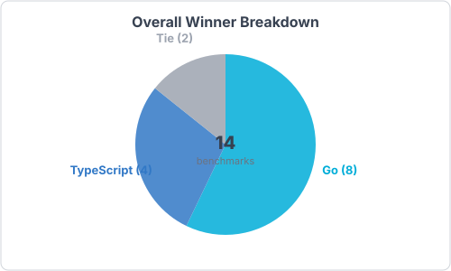
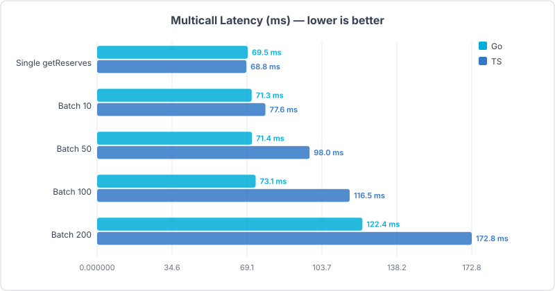
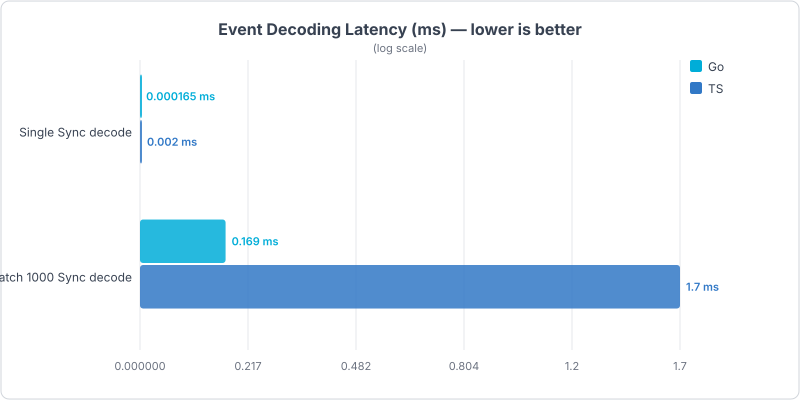
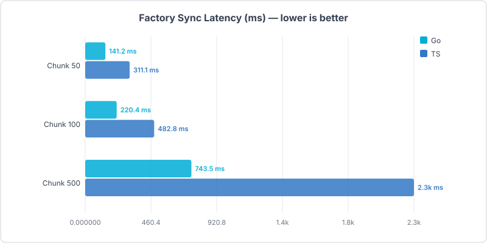
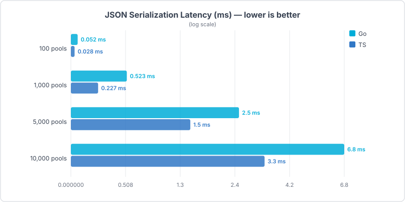
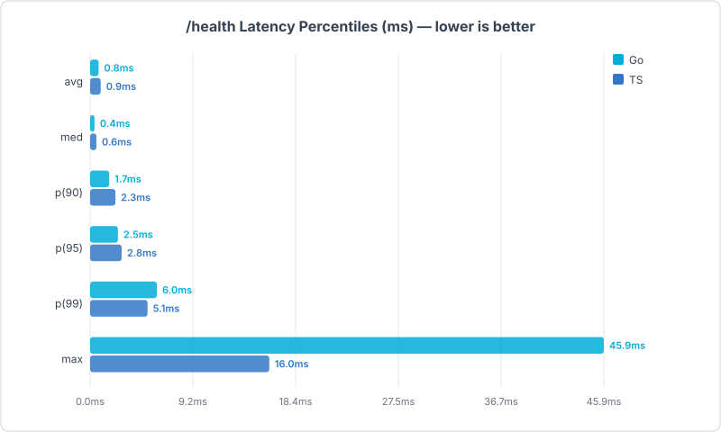
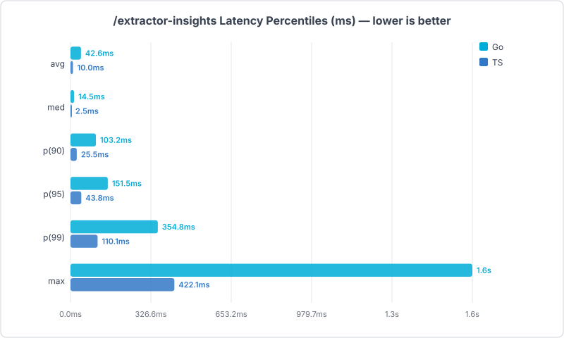
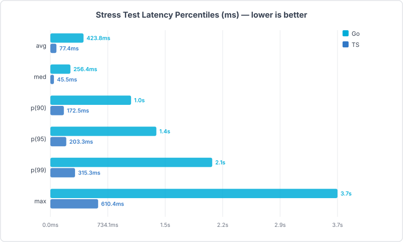

# viem-go: A Go Implementation of viem

[viem-go](https://github.com/ChefBingbong/viem-go) brings the developer experience of [viem](https://viem.sh/) to Go. This repository demonstrates that by building the **same UniswapV2 pool extractor** in both TypeScript (viem) and Go (viem-go) — the APIs, patterns, and architecture are nearly identical.

## Why viem-go?

If you've used viem in TypeScript, you already know viem-go. The library mirrors viem's client model, action-based API, multicall batching, chain definitions, and transport layer — so the mental model transfers directly. You write the same logic, with the same structure, in Go.

---

## Side-by-Side: The Same Extractor in Both Languages

Both extractors do identical work: create a public client, sync UniswapV2 pools via multicall, watch blocks for Sync events, resolve ERC-20 token metadata, and serve the data over HTTP.

### Creating a Public Client

**TypeScript (viem)**
```typescript
import { createPublicClient, http } from 'viem'
import { mainnet } from 'viem/chains'

const client = createPublicClient({
  chain: mainnet,
  transport: http(RPC_URL),
  batch: { multicall: { batchSize: 2048, wait: 16 } },
  pollingInterval: 200,
})
```

**Go (viem-go)**
```go
import (
    "github.com/ChefBingbong/viem-go/chain/definitions"
    "github.com/ChefBingbong/viem-go/client"
    "github.com/ChefBingbong/viem-go/client/transport"
)

c, _ := client.CreatePublicClient(client.PublicClientConfig{
    Chain:     &definitions.Mainnet,
    Transport: transport.HTTP(rpcURL),
    Batch: &client.BatchOptions{
        Multicall: &client.MulticallBatchOptions{
            BatchSize: 2048,
            Wait:      16 * time.Millisecond,
        },
    },
    PollingInterval: 200 * time.Millisecond,
})
```

The config shape is the same: `chain`, `transport`, `batch.multicall`, `pollingInterval`. The only difference is Go's explicit types.

### Multicall — Batched Contract Reads

**TypeScript (viem)**
```typescript
const results = await client.multicall({
  contracts: [
    { address: pairAddr, abi: uniswapV2PairAbi, functionName: 'getReserves' },
    { address: pairAddr, abi: uniswapV2PairAbi, functionName: 'token0' },
    { address: pairAddr, abi: uniswapV2PairAbi, functionName: 'token1' },
  ],
  allowFailure: true,
})

if (results[0].status === 'success') {
  const [r0, r1] = results[0].result
}
```

**Go (viem-go)**
```go
results, _ := public.Multicall(ctx, c, public.MulticallParameters{
    Contracts: []public.MulticallContract{
        {Address: pairAddr, ABI: pairABI, FunctionName: "getReserves"},
        {Address: pairAddr, ABI: pairABI, FunctionName: "token0"},
        {Address: pairAddr, ABI: pairABI, FunctionName: "token1"},
    },
    AllowFailure: boolPtr(true),
})

if results[0].Status == "success" {
    vals := results[0].Result.([]any)
    r0, r1 := vals[0].(*big.Int), vals[1].(*big.Int)
}
```

Same `contracts` array, same `allowFailure` flag, same `status`/`result` pattern. viem-go batches these into a single `eth_call` to `Multicall3` just like viem does.

### Token Resolution via Multicall

**TypeScript (viem)**
```typescript
const results = await this.client.multicall({
  contracts: [
    { address, abi: erc20Abi, functionName: 'decimals' },
    { address, abi: erc20Abi, functionName: 'symbol' },
    { address, abi: erc20Abi, functionName: 'name' },
  ],
  allowFailure: true,
})

if (decimalsR.status === 'failure') return
if (symbolR.status === 'failure' || nameR.status === 'failure') {
  // bytes32 fallback
}
```

**Go (viem-go)**
```go
results, _ := public.MulticallConcurrent(ctx, tm.client, public.MulticallParameters{
    Contracts: []public.MulticallContract{
        {Address: address, ABI: erc20ABI, FunctionName: "decimals"},
        {Address: address, ABI: erc20ABI, FunctionName: "symbol"},
        {Address: address, ABI: erc20ABI, FunctionName: "name"},
    },
    AllowFailure: boolPtr(true),
})

if decimalsR.Status == "failure" { return nil, nil }
if symbolR.Status == "failure" || nameR.Status == "failure" {
    // bytes32 fallback
}
```

Identical logic: multicall 3 ERC-20 reads, check for failures, fall back to bytes32 ABI. viem-go even has `MulticallConcurrent` which automatically batches concurrent goroutine calls into fewer RPC requests — the Go equivalent of viem's request deduplication.

### Sync Event Processing

**TypeScript (viem)**
```typescript
logFilter.addFilter(UniV2EventsListenAbi, (logs?: Log[]) => {
  logs.forEach((l) => {
    const { args: { reserve0, reserve1 } } = decodeEventLog({
      abi: UniV2EventsListenAbi, data: l.data, topics: l.topics,
    })
    const pool = this.poolMap.get(l.address.toLowerCase())
    if (pool) {
      pool.reserve0 = reserve0
      pool.reserve1 = reserve1
    }
  })
})
```

**Go (viem-go)**
```go
logFilter.AddFilter([]string{SyncEventTopic.Hex()}, func(logs []formatters.Log) {
    for _, l := range logs {
        reserve0, reserve1, _ := DecodeSyncEvent(l)
        addrL := strings.ToLower(l.Address)

        ext.poolMu.RLock()
        pool, exists := ext.poolMap[addrL]
        ext.poolMu.RUnlock()

        if exists {
            ext.poolMu.Lock()
            pool.Reserve0 = reserve0
            pool.Reserve1 = reserve1
            ext.poolMu.Unlock()
        }
    }
})
```

Same pattern: register a filter with topics, receive logs, decode the event, update the pool map. The Go version adds a mutex for thread safety since goroutines are truly concurrent (vs JS single-threaded event loop).

### Extractor Architecture

Both versions share the same component structure:

| Component | TypeScript | Go |
|-----------|-----------|-----|
| Client | `PublicClient` from viem | `*client.PublicClient` from viem-go |
| Extractor | `Extractor` class | `Extractor` struct |
| Pool indexer | `UniV2Extractor` class | `UniV2Extractor` struct |
| Token resolver | `TokenManager` class | `TokenManager` struct |
| Block watcher | `LogFilter2` class | `LogFilter2` struct |
| Cache | `PermanentCache<T>` | `PermanentCache[T]` (generics) |

The file layout even mirrors:

```
mini-extractor-ts/              mini-extractor-go/
├── config.ts                   ├── config.go
├── index.ts                    ├── main.go
├── extractor/                  ├── extractor/
│   ├── Extractor.ts            │   ├── extractor.go
│   ├── UniV2Extractor.ts       │   ├── univ2_extractor.go
│   ├── LogFilter2.ts           │   ├── log_filter.go
│   ├── TokenManager.ts         │   ├── token_manager.go
│   ├── PermanentCache.ts       │   ├── permanent_cache.go
│   └── UniV2Types.ts           │   └── univ2_types.go
├── handlers/                   ├── handlers/
│   └── extractor-insights.ts   │   └── extractor_insights.go
└── lib/                        └── lib/
    ├── logger.ts                   ├── logger.go
    └── token.ts                    └── token.go
```

---

## Setup

### Prerequisites

- [Bun](https://bun.sh/) (v1.3+)
- [Go](https://go.dev/) (v1.24+)
- [k6](https://grafana.com/docs/k6/latest/set-up/install-k6/) (for API load tests)
- An Ethereum RPC URL

### Install

```bash
# Copy env template and set your RPC URL
cp .env.example .env

# Install TypeScript dependencies
make install

# Verify Go dependencies
cd mini-extractor-go && go mod tidy && cd ..
```

### Run

```bash
make ts              # Start TypeScript extractor only
make go              # Start Go extractor only
make dev             # Start both in parallel
```

---

## Benchmarks

### CPU / Library Microbenchmarks

Benchmark the core viem library operations in isolation — no running services needed, just an RPC URL.

```bash
make bench-all       # Run Go + TS benchmarks + generate comparison report
```

Both harnesses use identical config: `benchtime=3s`, `count=3`, `warmup=none`.

### k6 API Load Tests

Test HTTP endpoints under concurrent load. Each service is tested independently (no interleaving).

```bash
make dev             # Terminal 1: start both services
make k6-all          # Terminal 2: run all k6 suites + comparison
```

All tests use `?limit=1000` to ensure equal data volume.

### Regenerating Reports

```bash
make bench-compare   # CPU benchmark comparison
make k6-compare      # k6 API comparison
```

Reports are written to `bench/comparison-results/` with SVG charts.

---

<details>
<summary><h2>Full Benchmark Results (click to expand)</h2></summary>

### CPU Benchmark Summary

> CPU: Apple M4 Pro | RPC: QuickNode Ethereum Mainnet | 3 runs averaged



| Category | Go Wins | TS Wins | Ties | Winner |
|----------|---------|---------|------|--------|
| Multicall (RPC batching) | 3 | 0 | 2 | Go |
| Event Decoding (CPU-bound) | 2 | 0 | 0 | Go |
| Factory Sync (full pipeline) | 3 | 0 | 0 | Go |
| JSON Serialization | 0 | 4 | 0 | TypeScript |
| **Total** | **8** | **4** | **2** | **Go** |

---

#### Multicall Performance



| Batch Size | Go | TypeScript | Winner | Speedup |
|------------|-----|-----------|--------|---------|
| 1 contract | 69.9ms | 71.8ms | Tie | ~1.0x |
| 10 contracts | 74.4ms | 71.0ms | Tie | ~1.0x |
| 50 contracts | 74.6ms | 93.5ms | Go | 1.3x |
| 100 contracts | 83.6ms | 220.1ms | Go | 2.6x |
| 200 contracts | 97.6ms | 345.5ms | Go | 3.5x |

At small batch sizes both libraries are equal — latency is dominated by the RPC round-trip. As batch size grows, Go scales linearly while viem shows increasing overhead. At 200 contracts, Go is **3.5x faster**.

---

#### Event Decoding



| Benchmark | Go | TypeScript | Speedup |
|-----------|-----|-----------|---------|
| Single decode | 238 ns/op | 2,178 ns/op | Go **9.1x** faster |
| 1000 decodes | 200 us | 2,160 us | Go **10.8x** faster |

Go's `DecodeSyncEvent` does direct byte slicing (two `big.Int.SetBytes` calls), while viem's `decodeEventLog` performs full ABI schema lookup and typed decoding. Go is an order of magnitude faster here.

---

#### Factory Sync (On-Chain Data at Scale)



| Chunk Size | Go | TypeScript | Speedup |
|------------|-----|-----------|---------|
| 50 pools | 157ms | 346ms | Go **2.2x** faster |
| 100 pools | 222ms | 284ms | Go **1.3x** faster |
| 500 pools | 764ms | 935ms | Go **1.2x** faster |

This simulates the real `syncFactoryStreaming` hot path: fetch pair addresses, then batch-fetch token0/token1/getReserves. Go wins at all sizes.

---

#### JSON Serialization



| Pool Count | Go | TypeScript | Speedup |
|------------|-----|-----------|---------|
| 100 | 52 us | 28 us | TS **1.9x** faster |
| 1,000 | 523 us | 227 us | TS **2.3x** faster |
| 5,000 | 2.54ms | 1.45ms | TS **1.7x** faster |
| 10,000 | 6.81ms | 3.29ms | TS **2.1x** faster |

Bun's `JSON.stringify` (Zig-optimized) is consistently ~2x faster than Go's `encoding/json`. Switching Go to `sonic` or `go-json` would likely close this gap.

---

### k6 API Load Test Results

Each service is tested independently (no interleaving) with `?limit=1000`.

#### /health — Lightweight Endpoint



| Percentile | Go | TypeScript | Speedup |
|------------|-----|-----------|---------|
| avg | 23.5ms | 1.9ms | TS **12.2x** |
| p50 | 11.1ms | 0.3ms | TS **36.4x** |
| p95 | 84.6ms | 5.9ms | TS **14.3x** |
| p99 | 162.3ms | 21.0ms | TS **7.7x** |

#### /extractor-insights — Heavy Endpoint



| Percentile | Go | TypeScript | Speedup |
|------------|-----|-----------|---------|
| avg | 42.6ms | 10.0ms | TS **4.3x** |
| p50 | 14.5ms | 2.5ms | TS **5.7x** |
| p95 | 151.5ms | 43.8ms | TS **3.5x** |
| p99 | 354.8ms | 110.1ms | TS **3.2x** |

#### Stress Test — 50 Steady to 200 Spike VUs



| Percentile | Go | TypeScript | Speedup |
|------------|-----|-----------|---------|
| avg | 423.8ms | 77.4ms | TS **5.5x** |
| p50 | 256.4ms | 45.5ms | TS **5.6x** |
| p95 | 1,354.9ms | 203.3ms | TS **6.7x** |
| p99 | 2,069.0ms | 315.3ms | TS **6.6x** |

| Metric | Go | TypeScript |
|--------|-----|-----------|
| Total requests | 28,350 | 135,796 |
| Throughput | ~147 req/s | ~706 req/s |
| Error rate | 0% | 0% |

TypeScript (Bun/Elysia) dominates API serving. Its event-loop HTTP server handles concurrency more efficiently than Go's goroutine-per-connection `net/http`. Go's JSON serialization overhead (2x slower) compounds under load. Switching to `fasthttp` + `sonic` would likely close the gap.

---

### Overall Verdict

| Dimension | Winner | Key Insight |
|-----------|--------|-------------|
| **RPC Multicall** | Go | 3.5x faster at large batch sizes |
| **Event Decoding** | Go | 9-11x faster (compiled vs interpreted) |
| **Factory Sync** | Go | 1.2-2.2x faster data pipeline |
| **JSON Serialization** | TypeScript | 1.7-2.3x faster (Bun's Zig JSON) |
| **HTTP API** | TypeScript | 5-14x lower latency under load |

**Go** excels at the data pipeline (fetching, decoding, syncing on-chain data). **TypeScript** excels at the API layer (serving data under concurrent load). In production, the optimal architecture might be a Go indexer feeding a Bun/TS API server.

</details>

---

## Project Structure

```
viem-go-extractor-demo/
├── mini-extractor-ts/       # TypeScript extractor (Bun + viem + Elysia)
├── mini-extractor-go/       # Go extractor (viem-go + net/http)
├── bench/
│   ├── go/                  # Go microbenchmarks (testing.B)
│   ├── ts/                  # TypeScript microbenchmarks
│   ├── k6/                  # k6 API load test scripts
│   ├── compare.ts           # CPU bench comparison + chart generator
│   ├── compare-k6.ts        # k6 comparison + chart generator
│   └── comparison-results/  # Generated reports + SVG charts
├── .env                     # Shared environment (RPC_URL, ports, etc.)
├── Makefile                 # All commands
└── README.md
```
